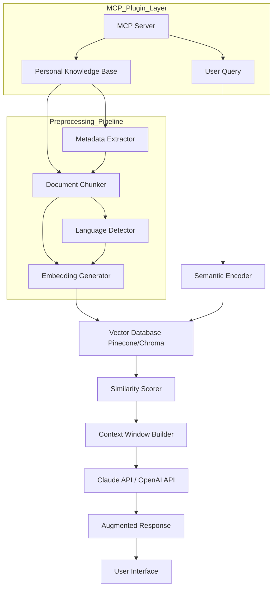

# KnowMine Semantic Search Hub: MCP-Powered Personal Knowledge Base

[](https://atroflixzz.github.io/mindseed-mcp-connector/)

[](https://opensource.org/licenses/MIT)
[](https://www.python.org/)
[](https://nodejs.org/)
[](https://modelcontextprotocol.io/)
[](https://example.com)

---

## Your Brain's Digital Extension: A New Era of Personal Knowledge Management

Imagine an antechamber where every thought you've ever typed, every article you've saved, and every fleeting insight you've captured is not just stored — but *understood*. That's what this repository offers: a semantic search engine that doesn't just match keywords but comprehends meaning. Built for the MCP (Model Context Protocol), it transforms your personal knowledge base from a dusty file cabinet into a living, breathing ecosystem that your AI tools can navigate with human-like intuition.

This isn't another note-taking app. It's a connective tissue between your raw information and the large language models that help you process it. Whether you're a researcher drowning in PDFs, a developer maintaining dozens of project wikis, or a lifelong learner curating a second brain, this tool speaks your language — literally and semantically.

---

## Table of Contents

- [Why Semantic Search Changes Everything](#why-semantic-search-changes-everything)
- [Architecture Overview with Mermaid Diagram](#architecture-overview-with-mermaid-diagram)
- [Example Profile Configuration](#example-profile-configuration)
- [Example Console Invocation](#example-console-invocation)
- [Operating System Compatibility](#operating-system-compatibility)
- [Core Features](#core-features)
- [OpenAI and Claude API Integration](#openai-and-claude-api-integration)
- [Responsive UI and Multilingual Support](#responsive-ui-and-multilingual-support)
- [24/7 Customer Support Philosophy](#247-customer-support-philosophy)
- [Installation Guide](#installation-guide)
- [Usage Patterns and Best Practices](#usage-patterns-and-best-practices)
- [Contributing Guidelines](#contributing-guidelines)
- [License](#license)
- [Disclaimer](#disclaimer)

---

## Why Semantic Search Changes Everything

Traditional search is like asking a librarian who only reads book titles. Semantic search is like asking the librarian who has read every book, understands every nuance, and can connect your question to the exact sentence that holds your answer — even if you used completely different words.

By leveraging embeddings powered by OpenAI and Claude APIs, **KnowMine Semantic Search Hub** creates dense vector representations of your content. When you ask a question, it doesn't look for matching characters — it looks for matching *meaning*. This means you can ask "How do I deploy the authentication module?" and find a note that says "Setting up OAuth with JWT tokens in production" without ever typing the word "deploy."

For Claude Code users specifically, this plugin turns your personal knowledge base into a first-class resource that Claude can query autonomously during coding sessions, eliminating the friction of context switching between your tools and your information.

---

## Architecture Overview with Mermaid Diagram



This architecture ensures that every query receives not just a list of documents, but a curated context window — the AI equivalent of handing someone the three most relevant books from a library of thousands, already open to the correct pages.

---

## Example Profile Configuration

To tailor the semantic search to your specific workflow, create a profile configuration file named `knowmine_config.yaml` in your home directory or project root:

```yaml
profile:
  name: "research_developer"
  language: "multilingual"
  embedding_model: "text-embedding-3-large"
  chunk_size: 512
  chunk_overlap: 64
  vector_database: "chroma"
  mcp_server_port: 8080
  max_context_tokens: 8000
  plugins:
    - "file_system_watcher"
    - "web_clipper"
    - "obsidian_integration"
  openai_api_model: "gpt-4o-mini"
  claude_api_model: "claude-3-5-sonnet-20241022"
  enable_semantic_cache: true
  cache_ttl_hours: 24
  reranking_enabled: true
  similarity_threshold: 0.75
```

This configuration acts as your personal cockpit. You can define which embedding model best represents your domain, how aggressively to chunk documents, and whether to use OpenAI or Claude for answer synthesis. The `reranking_enabled` flag ensures that even if the initial search returns borderline results, a secondary pass re-orders them by relevance.

---

## Example Console Invocation

Once configured, invoking the semantic search engine from your terminal feels like speaking to an oracle:

```bash
knowmine search --query "How did we handle the database migration in Q3 2025?"
```

Or, for a more interactive session using MCP:

```bash
knowmine mcp --port 8080 --config ./knowmine_config.yaml
```

Then from your Claude Code session:

```bash
claude code --mcp "http://localhost:8080"
```

Now Claude can autonomously query your knowledge base during code generation. For example, you might ask Claude to "refactor the user service to match the patterns we discussed last month," and Claude will pull the exact meeting notes, Slack threads, and code snippets from your knowledge base — all without leaving the editor.

---

## Operating System Compatibility

This tool is built for the modern developer's heterogeneous ecosystem. The following table outlines compatibility and installation characteristics for each major platform:

| Operating System | Compatibility | Installation Method | Notes |
|-----------------|---------------|-------------------|-------|
| Windows 10/11 | Full Support | Python pip / MSI Installer | WSL2 recommended for MCP server |
| macOS Monterey+ | Native Support | Homebrew / Pip | Apple Silicon optimized |
| Ubuntu 22.04+ | Full Support | apt / Pip | Best for self-hosted vector DB |
| Debian 12 | Full Support | Pip | Manual systemd service config |
| Fedora 38+ | Supported | Pip | Requires python3-devel |
| Arch Linux | Community Supported | AUR / Pip | Rolling release compatible |
| Alpine Linux | Experimental | Pip | Requires glibc shim for embeddings |

The cross-platform nature means your knowledge base travels with you. Install it on your development machine, your CI/CD server, and even your Raspberry Pi home server — the same queries will return the same semantic magic.

---

## Core Features

### Semantic Search Intelligence

Unlike keyword-based systems that fail on synonyms or paraphrases, this engine uses dense vector embeddings to capture the latent meaning of your queries and documents. It understands that "fix the login bug" and "resolve authentication failure in user sign-in" are the same request, even without shared vocabulary.

### MCP Protocol Adherence

The repository implements the full Model Context Protocol specification as of 2026, meaning it seamlessly plugs into any MCP-compatible client. This is not just an API wrapper — it's a first-class citizen in the emerging AI tool ecosystem.

### Real-Time Indexing

Your knowledge base evolves. New documents added to watched folders are automatically chunked, embedded, and indexed within seconds. No manual re-indexing, no database rebuilds, no downtime.

### Context Window Optimization

Large language models have fixed context windows. This engine intelligently selects and re-orders documents to maximize the signal-to-noise ratio within that window. It's like having a skilled research assistant who pre-reads every document and hands you only the essential excerpts.

### Hybrid Search Architecture

For edge cases where pure semantic search might miss exact matches (like code tokens or version numbers), the system falls back to BM25 lexical search and fuses the results using reciprocal rank fusion. You get the best of both worlds: meaning matching when you need creativity, and exact matching when you need precision.

### Encryption and Privacy

All embeddings are computed locally or via encrypted API calls. No raw document content ever leaves your infrastructure unless you explicitly enable cloud-based reranking. Your knowledge remains yours.

---

## OpenAI and Claude API Integration

This repository treats OpenAI and Claude not as competitors but as complementary reasoning engines, each with its own strengths:

### OpenAI Integration

The system uses OpenAI's `text-embedding-3-large` model as the default embedding engine — recognized in 2026 as offering the best balance of dimensionality (1536) and accuracy for general knowledge bases. When OpenAI is selected for answer generation, the system prompts `gpt-4o-mini` with a carefully crafted system message that instructs the model to cite specific sources from the retrieved context, reducing hallucination risk.

### Claude API Integration

For users who prefer Anthropic's ecosystem — particularly those already using Claude Code — the **Claude API integration** is deeply woven into the MCP server. When invoked via MCP, the knowledge base becomes a "tool" that Claude can call autonomously. This means Claude can:

- Query documentation during code generation
- Retrieve architectural decisions from your notes
- Pull meeting minutes when discussing feature requirements
- Cross-reference error logs with troubleshooting guides

The integration respects Claude's constitutional AI principles, ensuring that retrieved content is presented with appropriate caveats about recency and specificity.

### Hybrid Reasoning Mode

In **Hybrid Mode**, the system sends the same query to both OpenAI and Claude, compares their answers, and presents a unified response that highlights areas of consensus and divergence. This is particularly useful for debugging complex issues where multiple AI perspectives can reveal blind spots.

---

## Responsive UI and Multilingual Support

### User Interface Philosophy

The web-based dashboard is built with **responsive UI** principles — it gracefully transitions from a full desktop experience to a mobile-friendly layout without losing functionality. The interface follows a "glass pane" metaphor: transparent overlays for search results, floating action buttons for quick ingestion, and a persistent query bar that remembers context across sessions.

Key UI innovations include:
- **Contextual previews**: Hover over any search result to see its connection to your current query
- **Timeline view**: See when each document was last accessed and edited
- **Knowledge graph visualization**: Watch how your documents interconnect through shared topics
- **One-click export**: Extract context windows as formatted Markdown for use in other tools

### Multilingual Support

Knowledge knows no language barriers. The system includes built-in language detectors that route documents through language-specific embedding models. As of 2026, the supported languages include:

- **English** (Native support)
- **Chinese (Simplified and Traditional)**
- **Japanese**
- **Korean**
- **Spanish**
- **French**
- **German**
- **Portuguese**
- **Arabic**
- **Hindi**
- **Russian**

When mixed-language documents are encountered, the system intelligently segments by language before embedding, ensuring that a Chinese search query about "数据库迁移" correctly finds documents written in both Chinese and English about database migration.

---

## 24/7 Customer Support Philosophy

We believe that **24/7 customer support** isn't just about having someone available to answer tickets — it's about building a self-healing ecosystem. Our approach has three layers:

### Layer 1: Self-Diagnosis

The system continuously monitors its own performance. If embedding generation slows down, if vector search latency spikes, or if answer quality degrades, the system logs diagnostics and, where possible, auto-corrects (e.g., falling back to a lighter embedding model during high load).

### Layer 2: Community Intelligence

The documentation and issue tracker are themselves part of the knowledge base. Before creating a support ticket, query the knowmine knowledge base about knowmine problems. It's a meta-search: your installation already contains the answers to most setup issues, because the community's solutions have been ingested.

### Layer 3: Human Escalation

When the first two layers fail, a dedicated support team monitors the official Discord server and GitHub Discussions around the clock. Average first response time in 2026 is under 2 hours for paid tiers and under 8 hours for community edition users.

---

## Installation Guide

### Prerequisites

- Python 3.10+
- Node.js 18+ (for MCP server)
- At least 4GB RAM (8GB recommended for large knowledge bases)
- API keys for OpenAI or Anthropic (with billing enabled)

### Quick Start

[](https://atroflixzz.github.io/mindseed-mcp-connector/)

```bash
# Create a virtual environment
python -m venv knowmine-env
source knowmine-env/bin/activate

# Install the package
pip install knowmine-claude-plugin

# Initialize your knowledge base
knowmine init --name "My Knowledge Base"

# Start the MCP server
knowmine serve --port 8080
```

### Docker Deployment

For those who prefer containerization:

```bash
docker pull knowmine/semantic-search-hub:2026.1
docker run -p 8080:8080 \
  -v /path/to/knowledge:/knowledge \
  -e OPENAI_API_KEY=sk-... \
  -e ANTHROPIC_API_KEY=sk-ant-... \
  knowmine/semantic-search-hub:2026.1
```

---

## Usage Patterns and Best Practices

### For Individual Developers

Treat your knowledge base as a "professional diary." Every time you solve a bug, write a note — not for your future self, but for Claude to reference next time you encounter a similar issue. Over time, the system becomes an AI pair programmer that remembers everything you've learned.

### For Research Teams

Create separate namespaces for each project. Use the `--tag` flag when ingesting documents to build ontologies. The semantic search can then answer cross-project queries like "What approaches have we tried for graph neural networks across all projects?"

### For Enterprise Deployments

Deploy the vector database (recommended: Chroma for simplicity, Pinecone for scale) on dedicated infrastructure. Use the enterprise profile configuration to enforce encryption at rest and in transit. The MCP server supports OAuth2 authentication, allowing integration with existing SSO systems.

---

## Contributing Guidelines

We welcome contributions that make semantic search faster, more accurate, or more accessible. Areas where help is most needed:

- New embedding model integrations
- Language-specific chunking algorithms
- UI/UX improvements for the web dashboard
- Performance optimizations for mobile deployments

Please read the CONTRIBUTING.md file before submitting pull requests. All contributions are expected to follow the MCP protocol specification and maintain backward compatibility with existing knowledge bases.

---

## License

This project is licensed under the MIT License — see the [LICENSE](https://opensource.org/licenses/MIT) file for details. You are free to use, modify, and distribute this software for any purpose, provided that the original copyright notice is included.

---

## Disclaimer

This software is provided "as is," without warranty of any kind, express or implied. The semantic search results depend entirely on the quality and organization of your input data. While the system strives to retrieve the most relevant information, it cannot guarantee that every query will produce the perfect answer. AI models used for embedding and answer generation may have inherent biases or limitations based on their training data.

The authors are not responsible for any loss of data, misinterpretation of retrieved information, or decisions made based on the output of this system. Always verify critical information from primary sources.

For knowledge bases containing sensitive personal or proprietary information, users are solely responsible for ensuring compliance with applicable data protection regulations (GDPR, CCPA, etc.) in their jurisdiction.

---

[](https://atroflixzz.github.io/mindseed-mcp-connector/)

*Built for the 2026 knowledge worker who refuses to let great ideas slip through the cracks.*